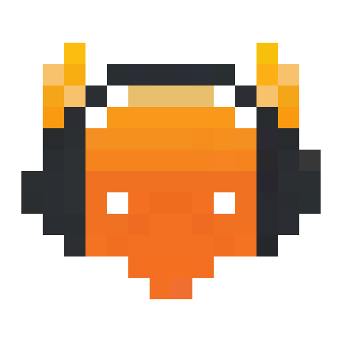

<div align="center">

<h1>Mumble-DJBot</h1>
<p>A self-hosted music bot for <a href="https://www.mumble.info/">Mumble</a>, controlled from chat and a web interface.</p>

<p>
<a href="LICENSE"></a>


</p>

<p><strong>English</strong> · <a href="README.zh-CN.md">简体中文</a></p>
</div>

---

Mumble-DJBot joins a Mumble channel and plays audio from YouTube, Bilibili, Spotify, live streams, internet radio and a local music library. Users request songs from chat or from a browser-based dashboard, which also provides queue management, personal playlists, cache management and listening statistics.

The project is a fork of [azlux/botamusique](https://github.com/azlux/botamusique), which has been archived upstream. This fork replaces the web interface, adds per-user playlists, playlist import, stream-while-downloading and channel following, and is designed to be deployed with Docker behind Cloudflare Tunnel and Cloudflare Access.

## Table of Contents

- [Features](#features)
- [Requirements](#requirements)
- [Installation](#installation)
- [Web Interface and Remote Access](#web-interface-and-remote-access)
- [Security Considerations](#security-considerations)
- [Usage](#usage)
- [Configuration](#configuration)
- [Development](#development)
- [Acknowledgements](#acknowledgements)
- [License](#license)

## Features

### Audio sources

- YouTube, Bilibili (BV identifiers or URLs), SoundCloud and other sites supported by [yt-dlp], including their playlists.
- Spotify tracks, playlists and keyword search, resolved to audio via [spotDL].
- Live streams, internet radio (including [radio-browser.info](https://www.radio-browser.info/) search) and local audio files.

### Playback

- **Stream while downloading.** Playback of long videos starts once roughly 30 seconds of audio is available, and the rest is downloaded in the background. In testing, a 50-minute Bilibili video started playing about 6 seconds after it was requested.
- **Non-music segment skipping.** Segments marked by the [SponsorBlock] and [BilibiliSponsorBlock] communities, such as spoken intros and sponsor reads, are skipped automatically.
- Queue prefetching, loudness normalization (`loudnorm`), automatic volume ducking while users speak, and stereo output.
- Five playback modes: one-shot, repeat, single-track loop, random and autoplay (random tracks from the library).

### Channel management

- The server's channel tree is shown live in the web interface. From there you can set a default channel or move the bot.
- Follow modes: follow the last user to leave an empty channel, or always follow a chosen user.
- Playback pauses automatically after a configurable idle period (5 minutes by default) and resumes when someone returns.

### Web interface

The dashboard is served at `/`. The original interface remains available at `/legacy`.

- **Now Playing:** artwork, progress, and a preparation panel that shows the current stage and the estimated time until playback starts.
- **Queue:** drag-and-drop reordering, plus unified search across YouTube and Bilibili.
- **Library:** browsing and resumable chunked uploads (up to 4 GB per file by default). Audio is extracted from video files.
- **Cache:** storage use and play counts. Frequently played tracks can be pinned or saved to the library. When the size limit is reached, the least recently used tracks are evicted first.
- **Statistics:** most played tracks, top requesters, busiest hours and most skipped tracks.

### Personal playlists

- Users are identified by the email address that Cloudflare Access passes through, and can set a display alias.
- Each user has their own playlists, which can be played immediately, shuffled or appended to the queue.
- Playlists can be imported from YouTube, NetEase Cloud Music, QQ Music and Spotify. Tracks from the last three are matched to YouTube sources, and matching handles both Simplified and Traditional Chinese titles.
- A Mumble account can be linked to the web identity with a one-time code (`!bind`). Linked users can manage their playlists from chat with `!mylist` and `!fav`.

### Reliability

- A watchdog restarts the process if the main loop stalls for more than 120 seconds, and a heartbeat file supports container health checks.
- Failed downloads are resumed and retried. A failure in one track does not affect the rest of the process.

## Requirements

- A Mumble server (Murmur) that the bot can reach.
- **Docker deployment (recommended):** Docker Engine with Docker Compose. Every runtime dependency is included in the image.
- **Bare-metal deployment:** Python 3.12, FFmpeg and the Opus codec. See [`deploy/DEPLOY.md`](deploy/DEPLOY.md).
- **Optional:** Spotify API credentials, required only for the `!spotify` command.
- **Optional:** a Cloudflare account, for remote access to the web interface.

## Installation

### 1. Clone the repository

```bash
git clone https://github.com/AidenOfficial/Mumble-DJBot.git
cd Mumble-DJBot
```

### 2. Create the configuration file

```bash
cp configuration.example.ini configuration.ini
```

> [!IMPORTANT]
> `configuration.ini` must exist before the container is started. Otherwise Docker creates a directory in its place and the bot cannot read its configuration.

A minimal configuration is shown below. Any option you leave out falls back to `configuration.default.ini`, which should not be edited.

```ini
[server]
host = mumble.example.com
port = 64738
; password = <server password>
channel = Music              ; use a slash for nested channels, e.g. Games/Squad

[bot]
username = MusicBot
admin = YourMumbleName       ; separate multiple administrators with semicolons
language = en_US             ; zh_CN, ja_JP, fr_FR, de_DE, ... (see lang/)

[webinterface]
enabled = True
listening_addr = 0.0.0.0     ; required inside the container; isolated by the Compose network

[spotify]
; Required only for the !spotify command. Spotify playlists of up to
; 100 tracks can be imported without credentials.
client_id =
client_secret =
```

### 3. Build and start

```bash
docker compose build
docker compose up -d
docker compose logs -f
```

The bot connects to the server as a regular client, so no ports need to be published. To confirm that it is running, join its channel and send `!help`.

### 4. Keep extractors up to date

On every start, the container upgrades yt-dlp and spotDL (`BAM_UPDATE_ON_START=1`). YouTube and Bilibili change often, so restart the container once a day, for example with a cron entry:

```cron
0 5 * * * docker restart mumble-music
```

For NAS deployment, cookies and routine maintenance, see [`deploy/DOCKER.md`](deploy/DOCKER.md).

## Web Interface and Remote Access

The recommended way to expose the web interface is Cloudflare Tunnel with Cloudflare Access. Cloudflare handles authentication, and port 8181 is never published.

1. In the Cloudflare Zero Trust dashboard, create a tunnel. Set its public hostname to point to `http://botamusique:8181`.
2. Create an Access application for the same hostname, with a policy that allows the intended email addresses.
3. Save the tunnel token and start the `tunnel` profile:

   ```bash
   echo 'CLOUDFLARE_TUNNEL_TOKEN=<token>' > .env
   docker compose --profile tunnel up -d
   ```

For detailed instructions, see [`deploy/WEBUI.md`](deploy/WEBUI.md).

## Security Considerations

> [!WARNING]
> The default `auth_method = none` performs no authentication in the application itself. It relies entirely on Cloudflare Access.

- **Do not expose port 8181** to the internet or to untrusted networks.
- **Enable Access JWT verification** by setting `access_team_domain` and `access_aud` under `[webinterface]`. The bot then rejects any request without a valid Access token, so traffic that bypasses the tunnel cannot impersonate a user.
- **Change `flask_secret`** to a long random value if you switch to `auth_method = token`, since it signs the session cookies.
- **Register administrator accounts** on the Mumble server. Administrators are currently identified by display name, so an unregistered name can be taken by another user while the administrator is offline.

## Usage

### Chat commands

Commands start with `!`; the full-width `！` is also accepted. Any unambiguous prefix works, so `!sk` runs `!skip`. Commands can be renamed in the `[commands]` section. Send `!help` for the complete list.

| Command | Description |
|---|---|
| `!url <link>` / `!bili <BV or link>` | Add the audio of a YouTube or Bilibili video |
| `!yplay <keywords>` / `!ysearch <keywords>` | Add the first YouTube result / list search results |
| `!spotify <link or keywords>` | Add a Spotify track or playlist, or search Spotify |
| `!playlist <link>` | Add an entire playlist |
| `!live <link>` / `!radio <name or link>` | Play a live stream or an internet radio station |
| `!file <path>` / `!filematch <keyword>` | Add tracks from the local library |
| `!play [n]` / `!pause` / `!skip` / `!stop` | Playback control |
| `!queue` / `!np` / `!rm <n>` | Show the queue / show the current track / remove a track |
| `!mode <1–5>` | One-shot, repeat, random, autoplay or single-track loop |
| `!repeat [n]` | Queue the current track again *n* times (maximum 20) |
| `!volume <0–100>` / `!duck on\|off` | Set the volume / toggle ducking |
| `!joinme` / `!oust` | Move the bot to your channel / stop and return to the default channel |
| `!bind <code>` / `!mylist [name] [shuffle]` / `!fav [name]` | Personal playlists (generate the code in the web interface) |
| `!web` | Show the web interface address |

Administrators listed in `[bot] admin` also have access to `!kill`, `!update`, `!urlban`, `!userban`, `!maxvolume`, `!webuseradd` and related commands.

## Configuration

[`configuration.example.ini`](configuration.example.ini) documents every option. The options most often changed are:

| Option | Default | Description |
|---|---|---|
| `[bot] stream_while_downloading` | `True` | Start long tracks before the download completes (applies to tracks of at least `stream_min_duration` seconds) |
| `[bot] tmp_folder_max_size` | `4096` | Download cache limit in MB; least recently used entries are evicted first |
| `[bot] max_track_duration` | `0` | Maximum track length in minutes; `0` disables the limit |
| `[bot] sponsorblock` | `True` | Skip non-music segments; categories are set in `sponsorblock_categories` |
| `[bot] when_nobody_in_channel` | `nothing` | Immediate action when the channel empties (`pause`, `stop`); the delayed auto-pause in the web settings is usually preferable |
| `[bot] playback_mode` | `one-shot` | Playback mode at startup |
| `[webinterface] max_upload_file_size` | `4G` | Maximum size of a single uploaded file |
| `[youtube_dl] cookie_file` | *(empty)* | Netscape-format cookies for Bilibili premium content or signed-in YouTube access |

The default channel, follow mode and idle auto-pause are set on the web interface's Settings page and do not need to be configured in the INI file.

## Development

### Running the tests

The test suite needs neither a Mumble server nor `pymumble`.

```bash
python3.12 -m venv venv
venv/bin/pip install -r requirements.txt pytest
venv/bin/python -m pytest tests
```

Python 3.12 is required: pymumble 2.x needs Python 3.12 or later, and Python 3.13 removed the `audioop` module. If you use 3.13, install `audioop-lts` as well.

### Building the web interface

The dashboard is in `webui/` and is built with Vue 3, TypeScript, Vite and Tailwind CSS 4.

```bash
cd webui
npm ci
npm run dev     # development server; proxies /api to 127.0.0.1:8181
npm run build   # writes the production build to webui/dist
```

`webui/dist` is committed to the repository so that deployments without Node.js work. The Docker image rebuilds it during the image build. Commit the updated build together with any frontend change.

### Smoke test

`scripts/smoke_test.py` checks the runtime environment and the Bilibili and Spotify download paths without connecting to Mumble. See [`deploy/VERIFY.md`](deploy/VERIFY.md).

### Project structure

| Path | Contents |
|---|---|
| `mumbleBot.py`, `bot/` | Entry point; connection handling, playback loop (`player.py`), channel following (`channels.py`), cache and cleanup |
| `media/` | Audio sources (URL, Bilibili, Spotify, live, radio, local files), the play queue, SponsorBlock |
| `commands/` | Chat command handlers |
| `interface.py`, `web_*.py` | Flask application: the legacy endpoints and the `/api/*` endpoints |
| `playlist_import.py` | Playlist import and YouTube matching |
| `webui/` | Web interface source and build output |
| `lang/` | Translations for chat messages and help text |
| `deploy/` | Deployment guides and systemd units |
| `tests/` | Unit tests |

## Acknowledgements

This project is based on [botamusique](https://github.com/azlux/botamusique) by Azlux and its contributors, including @TerryGeng and @mertkutay. It also builds on [pymumble](https://codeberg.org/pymumble/pymumble), [yt-dlp], [spotDL], [SponsorBlock], [BilibiliSponsorBlock] and [OpenCC](https://github.com/BYVoid/OpenCC).

## License

Released under the [MIT License](LICENSE).

[yt-dlp]: https://github.com/yt-dlp/yt-dlp
[spotDL]: https://github.com/spotDL/spotify-downloader
[SponsorBlock]: https://sponsor.ajay.app/
[BilibiliSponsorBlock]: https://bsbsb.top/
